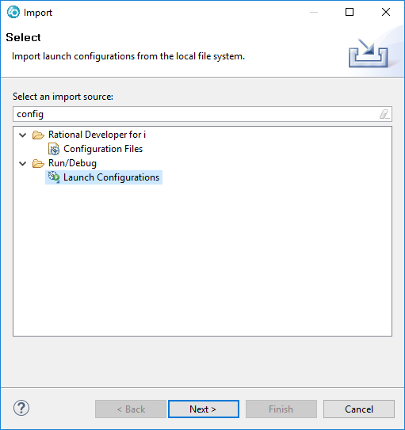
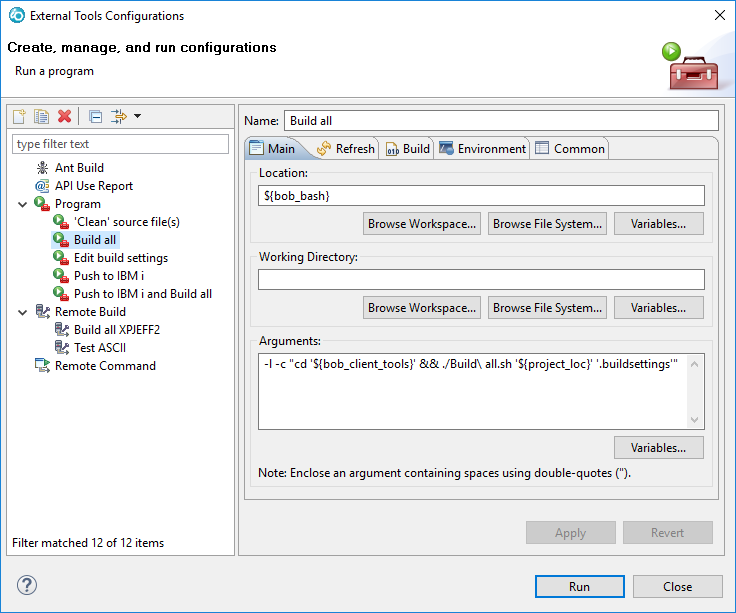
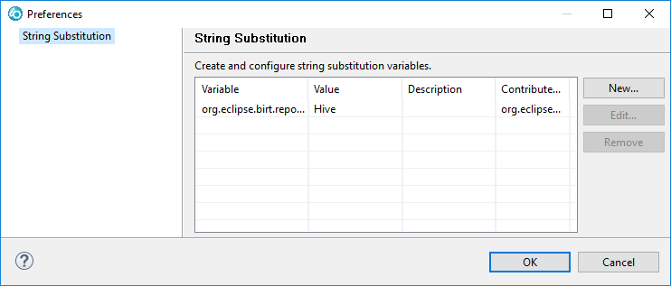
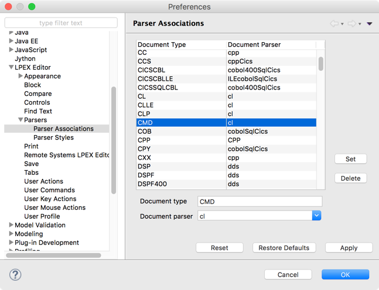
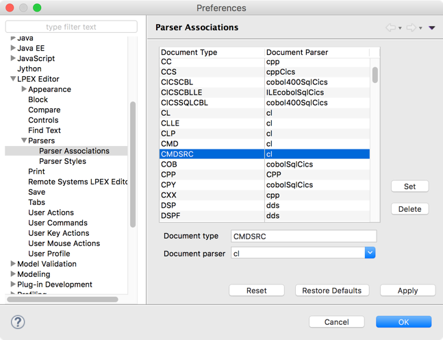
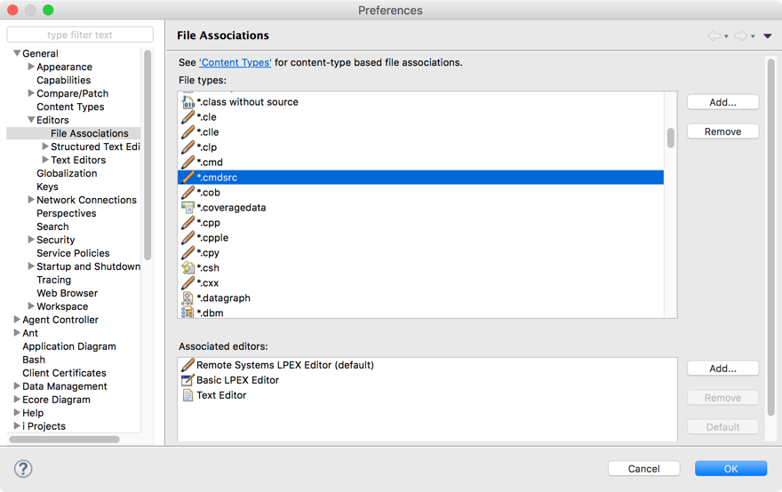
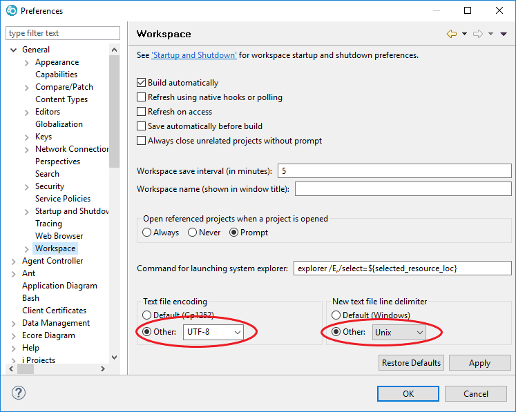

# Integrating Bob and RDi

> [!ATTENTION]
> The RDi integration is currently outdated. We will provide the updated integrations in the future versions.


This page documents how to configure the [Rational Developer for i](http://www-03.ibm.com/software/products/en/dev-ibm-i) IDE (RDi) to work with Bob.  When configured, an entire software product can be built by pressing one button in RDi.
Note that this support is still actively being redesigned to take advantage of the new support added and so these instructions may be out of date.


## Overview

By itself, the Bob build system runs on the IBM i as a PASE command line tool, to build standard QSYS objects from source code residing in an IFS directory.  [Client tools](integration/client-tools) are provided, however, to allow source code to be edited on a local PC and pushed to the i for building.

These instructions are detailed, but completing these steps is not terribly difficult and only needs to be done one time.

## Install Cygwin (only if running Windows)

The scripts that connect RDi with the build system are Bash shell scripts, so Windows users need to install something to give them Bash.  As of the time of this writing, Windows 10 does have a Linux subsystem, but it doesn't yet support running a Bash command from a background process.  We have had good results with Cygwin, which is a free Linux implementation that runs on Windows.

[Download Cygwin](https://cygwin.com/install.html) and perform just a basic install.  When selecting packages, add the _nano_, _openssh_, and _rsync_ packages.  There are several package options for each of these, but just select the actual package and not options that sound like "debug", "Devel", or "Libs".

## Generate and install RSA keys

RSA private/public key authentication is used by the scripts to connect to the IBM i without requiring a password every time they connect.  The `ssh-keygen` command will be used to generate the pair of keys; the private key will be used by the client-tools scripts, while the public key will be copied to the i.

1. If you already have a pair of RSA keys and want to use them to connect to the i, skip ahead to step 4.
1. Launch a Bash shell ("Terminal.app" on macOS or "Cygwin64 Terminal" on Windows).
1. Type `ssh-keygen -t rsa -C "your_email@domain.com"`. Press Enter to accept all the defaults (do not create a passphrase or you'll have to enter it each time the key is used).
1. The command will tell you where your new keys have been stored (e.g., `/home/jberman/.ssh/`).  The public key needs to be copied to the i and you may wish to move the private key to somewhere more convenient, if, for example, it currently resides inside the Cygwin "container" drive or if you already have a personal private key in the `.ssh` directory and you want this one to live elsewhere.
   1. If you wish to relocate your _private_ key, simply move the `id_rsa` file that was just created to the desired location, via Windows Explorer or equivalent.  If you created a key solely to connect to the i, you may wish to place it in a directory called `.ssh` in your development folder on your PC (for example, `C:\Users\your_name\Develop\.ssh\id_rsa`).  
   _Note: To create a directory that starts with a period using Windows Explorer, create it as '`.ssh.`'.  Explorer will drop the trailing dot when it creates the directory, for some reason._
   1. The _public key_, `id_rsa.pub`, needs to be copied into a file on the i called `authorized_keys`.  If this is your only public key then it is as simple as placing the `id_rsa.pub` file onto the i in directory `/home/your_userid/.ssh`, and then renaming it to `authorized_keys`.  If an `authorized_keys` file already exists at that location, simply copy the `id_rsa.pub` file to the i, start Qshell, and issue a command like the following to append the contents of the public key to the authorized_keys file:

      ```shell
      $ cat /home/your_userid/.ssh/id_rsa.pub >> /home/your_userid/.ssh/authorized_keys
      ```

      Note: According to [this document](http://www-01.ibm.com/support/docview.wss?uid=nas8N1012709), certain permissions need to be set on the .ssh directory and the authorized_keys file.  These commands are known to have worked (of course, substitute in your user profile name):
      ```shell
      $ chmod go-w /home/jberman
      $ chmod go-rwx /home/jberman/.ssh
      $ chmod go-rwx /home/jberman/.ssh/authorized_keys
      ```
1. Restart the SSH server: `ENDTCPSVR SERVER(*SSHD)`, `STRTCPSVR SERVER(*SSHD)`
1. Test the keys.  From within a Bash shell (such as "Cygwin64 Terminal"), enter: `ssh user@hostname -i /cygdrive/c/Users/username/.ssh/id_rsa`.  Substitute your username, name of the IBM i, and the location of your id_rsa file, of course.  If you successfully connect to the i without needing to enter a password, everything is working correctly.  (Once connected, type `exit` to disconnect from the i.)

## Install Bob client scripts

The Bob project (git@github.com:IBM/ibmi-bob) contains a `Client-tools` directory that contains scripts for running on a PC or Mac.  Copy the `Client-tools` directory to somewhere on your computer (e.g., `C:\Users\your_name\Develop\Bob\Client-tools` [PC] or `~/Develop/Bob/Client-tools` [Mac]).  The easiest way to do this is simply to use Git to clone the Bob project to that location on your PC, either with a GUI Git client or by command line:

_Windows (via Cygwin64 Terminal):_
```shell
$ cd /cygdrive/c/Users/username/Develop
$ git clone git@github.com:IBM/ibmi-bob.git
```

_macOS (via Terminal.app):_
```shell
$ cd ~/Develop
$ git clone git@github.com:IBM/ibmi-bob.git
```

## Import the external tools definitions into RDi
The mechanism we use in RDi to interface with the build system is an Eclipse feature called External Tools.  It looks like this:  


External tools allow us to create RDi menu items that call our own programs (the Client-tools scripts).  Bob external tools definitions have been created and exported to export files, which need only to be imported back into RDi.  The exported files are included in the Client-tools directory.
To import the tool definitions, choose `File → Import...` in RDi, select `Launch Configurations` from the `Run/Debug` tree item, and click `Next`:  


From the `Import Launch Configurations` window, click the `Browse` button and navigate to the `Client-tools/RDi external tools` directory, then click `OK`:  


Make sure the `RDi external tools` checkbox is selected, and click `Finish`:  


The imported definitions will now appear in the `Run → External Tools` menu option and the External Tools toolbar menu.  You may wish to reorder them, via `Run → External Tools → Organize Favorites...`:  


## Define external tools variables
Instead of hard-coding path names, the external tools definitions use Eclipse variables to give the developer greater flexibility.  These variables cannot be exported, so they need to be manually entered.

Choose `Run → External Tools → External Tools Configurations...`, and then select one of the external tool definitions that was just imported:  


Click one of the `Variables...` buttons.  It doesn't matter which one; they all lead to the same screen.  From the `Select Variable` window, click the `Edit Variables...` button.  This will bring up the String Substitution window:  


Click `New`, populate the fields, then click `OK`.  Repeat this process for all of the variables:

| Variable Name      | Value                                                        | Description                                                  |
| :----------------- | :----------------------------------------------------------- | :----------------------------------------------------------- |
| `bob_bash`         | The location of your bash executable. <br /> Mac: `/bin/bash` <br /> Windows: `c:\cygwin64\bin\bash.exe` | Location of the Bash shell on this system.                   |
| `bob_client_tools` | The location of the Bob/Client-tools directory, such as: <br /> Mac: `/Users/your_name/Develop/Source/Bob/Client-tools` <br /> Windows: `/cygdrive/c/Users/your_name/Develop/Source/Bob/Client-tools` | Location of the Bob client tools scripts, from a Bash context. |

When everything has been entered, it should look similar to this: 


Now exit out of the various External Tools windows, but make sure to exit the `Select Variable` window by clicking **`Cancel`**, or else it will insert an unwanted variable into the external tool definition.

## Map RDi file and parser associations

For Make to work properly, source and object files need to have different filenames.  Most IBM i source member types do differ from their compiled object types in name, but for those that don't, Bob differentiates source from object by expecting the filename to end in `SRC`: `.CMDSRC`, `.MENUSRC`, and `.PNLGRPSRC`.  These file suffixes should be defined to RDi so that these file types open in the correct editor with proper syntax coloring.

1. In RDi Preferences, navigate to `LPEX Editor` -> `Parsers` -> `Parser Associations`, then select the `CMD` document type:  
   

1. Add a new definition by changing the `Document type` from `CMD` to `CMDSRC`, then clicking `Set`:  
   

1. Do the same for the lower case version:  
   
1. Repeat the previous three steps for `PNLGRPSRC` and `MENUSRC` (Set `MENUSRC` to use document parser `uim`).

1. Next, navigate to `General` -> `Editors` -> `File Associations`, then select the `*.cmd` file type.
1. Add a definition for `*.cmdsrc` that is the same as the existing one for `*.cmd`, by clicking the top `Add...` button, entering a file type of `*.cmdsrc`, then clicking the bottom `Add...` button and selecting the same editors that `*.cmd` has:
   
1. Repeat the previous step for `*.menusrc` and `*.pnlgrpsrc`.

## Optional: Adjust workspace settings

Character encoding must be consistent throughout the entire development workflow, from the CCSID used to initially convert source members to text files, to editing the files, to sending them to the i to be built. Problems can occur if, for example, source members were converted to one CCSID, then accessed by RDi and sent to the i using different CCSIDs. Characters existing in one encoding but not the other will result in source code corruption, often without warning. RDi by default will encode source files using values inherited from the client OS. For Windows, this often will be CP1252 (Windows Latin-1) with CRLF line endings. RDi running on macOS defaults to UTF-8 and Unix line endings, so no adjustment is likely needed.

The easiest way to achieve consistent encoding is to change the RDi workspace default to use an appropriate encoding for your environment and Unix (LF) line endings. Once this is done, all source files created in the workspace will automatically use the correct encoding and line endings. If this step is omitted then the correct encoding value and line endings must be specified with each project, instead of once for the workspace.

To adjust the workspace settings:

1. In RDi Preferences, navigate to `General` -> `Workspace`.

1. Set `Text file encoding` to an appropriate value (UTF-8 is recommended, as it will preserve all characters).

1. Set `New text file line delimiter` to `Unix`.
   

## Define, on the i, IBMiMake's location
When installing Bob on the IBM i, the `IBMIMAKE` environment variable was set in one of the [profile](http://www-01.ibm.com/support/docview.wss?uid=nas8N1010486) files that are loaded when a shell starts up.  The exact profile file used depends on the shell used by that particular system.  As long as the environment variable is defined before a build starts, command line builds will work, but the client scripts expect it in – and in fact `source` it from – `/QOpenSys/etc/profile`.  Therefore, if `IBMIMAKE` is set in a different profile file because your shell doesn't load `/QOpenSys/etc/profile`, it will also need to be set in `/QOpenSys/etc/profile`, along with the other statements that were added to the other profile file:

1. First, create the `profile` file with the appropriate CCSID, if it doesn't exist:
    ```
    ===> qsh cmd('touch -C 819 /QOpenSys/etc/profile')
    ```
2. Copy the following into `/QOpenSys/etc/profile` (adjust the `LC_ALL` value as needed to match the character encoding specified on the previous step):
    ```shell
    # Stop PASE core dumps
    export PASE_SYSCALL_NOSIGILL=ALL:quotactl=EPERM:audit=0
    
    # Set environment variables for Bob build system
    IBMIMAKE='/Build/Bob/IBMiMake' # Location of IBMiMake makefile
    export IBMIMAKE
    
    # Set locale to UTF-8
    export LC_ALL='EN_US.UTF-8'
    
    # Set path to find IBM open source ports as well as Perzl AIX binaries
    PATH="/QOpenSys/QIBM/ProdData/OPS/tools/bin:/opt/freeware/bin:${PATH}"
    export PATH
    ```

Note that this only needs to be done once _**per IBM i system**_.

## Align your PC's clock with the IBM i's clock
For this distributed edit and remote build system to work, source file time stamps need to be in sync among all users.  Take steps to insure that clocks on all systems are accurate, such as by configuring machines to use a time server.  The PC or Mac's time can be adjusted in its respective system preferences panel.  A time server can be defined for use on IBM i by using the [`CHGNTPA` command](https://www.itjungle.com/2009/10/21/fhg102109-story03/).

***
*Technical note about external tool commands (for hardcore hacker types): If Cygwin is used, it resets the working directory to a default value when bash.exe starts up, which prevents us from using Eclipse's "Working Directory" field.  To work around this, the Bash command that is executed must start with `cd ${bob_client_tools} && ...` to set the current directory before calling the script, and variable `bob_client_tools` must be from a Bash context (`/cygdrive/c/Users/...`).  For Macs and for other Windows Bash implementations that behave differently, the external tool "Working Directory" field in Eclipse can instead be set to the `bob_client_tools` variable and the `cd` command can be omitted from the Bash command.  In this case, `bob_client_tools` would be from a native-OS context (`c:\Users\your_name\...`).  When configured this way, Eclipse will set the working directory before invoking Bash – the end result is the same, but the external tool definition will be cleaner.*